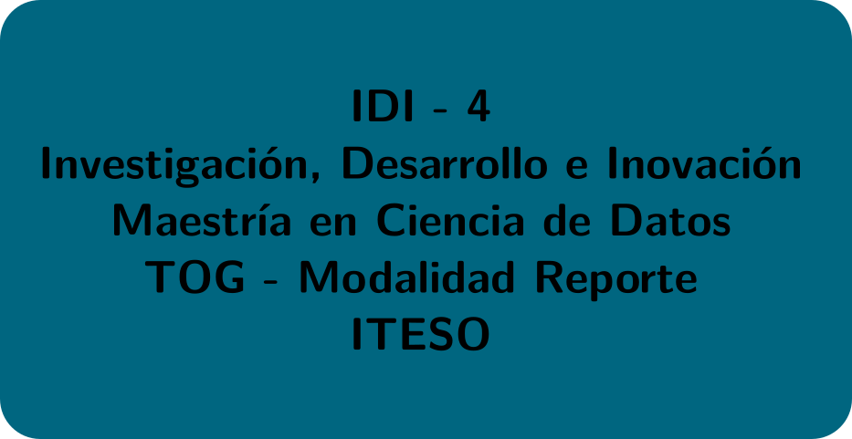

<figure>

  
      <figcaption></figcaption>

</figure>

Profesor: Emmanuel Alcalá
Horario: Por definir

Clase para el desarrollo de un proyecto para la obtención de grado en Maestría en Análisis de Datos.

---

El reporte se hará de acuerdo con la plantilla en Word [aquí](Estructura_TOG%20_RPP.docx)

Algunos ejemplos de reportes de este tipo en ML se pueden ver en la página del curso CS229: Machine Learning de Standford.

Proyectos finales de [2021](http://cs229.stanford.edu/proj2021spr/), [2019](http://cs229.stanford.edu/proj2019aut/) y [2014](http://cs229.stanford.edu/projects2014.html).

Ver la guía [Checklist de proyecto de Ciencia de Datos](checklist_ds_project.md)